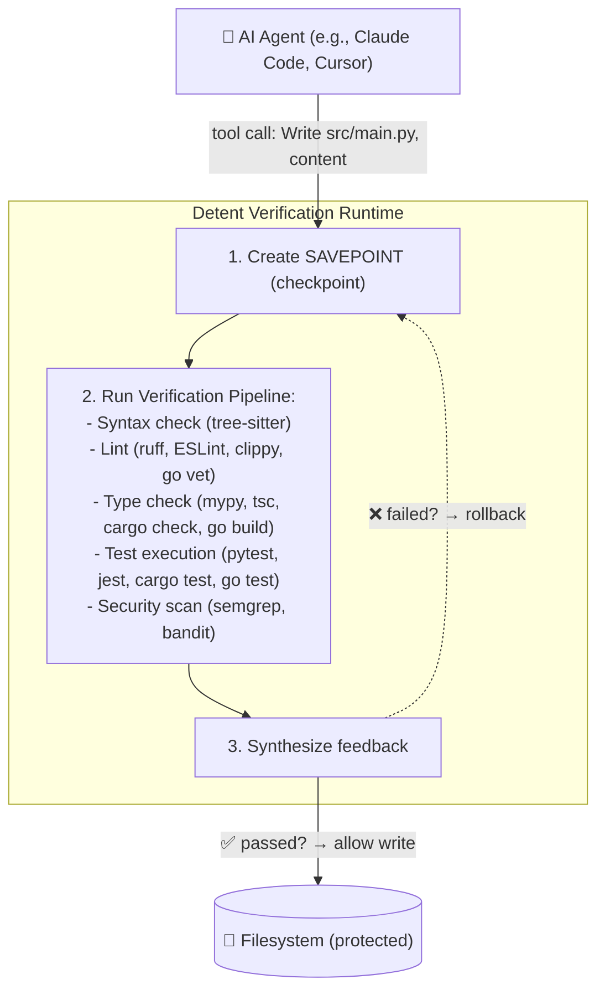

# Detent — Verification Runtime for AI Agents

> **Intercept. Verify. Rollback.** A verification runtime that sits between AI coding agents and the filesystem, running every proposed file write through a configurable verification pipeline and atomically rolling back on failure.

## The Problem

AI coding agents (Claude Code, Cursor, Codex) are powerful but unpredictable. They can write broken code, introduce security issues, or corrupt your codebase—all silently, before you notice.

Existing solutions are slow:

- **Code review tools** require human review (defeats the purpose of agents)
- **CI/CD** runs tests _after_ code hits the repo (too late to prevent damage)
- **Linters in editors** are superficial (don't catch logic errors or test failures)

You need a **protocol-level verification layer** that intercepts tool calls in real time, before they hit the filesystem.

## What Detent Does



## Key Features

✅ **Real-time interception** — Catches bad code before it hits your repo
✅ **Composable verification** — Chain stages: syntax → lint → typecheck → tests → security
✅ **Atomic rollback** — SAVEPOINT semantics for file operations
✅ **LLM-optimized feedback** — Structured JSON that helps agents self-repair
✅ **Multi-language support** — Python, JavaScript/TypeScript, Go, Rust
✅ **Four agent adapters** — Claude Code, Codex, Gemini (hook-based enforcement); LangGraph (VerificationNode)
✅ **Production-ready** — Security hardened, telemetry, circuit breakers, 427+ tests
✅ **CLI + Python SDK** — Use standalone or integrate with agents

## How It Differs

| Feature                | Detent | Code Review | CI/CD | Linters          |
| ---------------------- | ------ | ----------- | ----- | ---------------- |
| Real-time interception | ✅     | ❌          | ❌    | ✅ (editor only) |
| Prevents bad code      | ✅     | ❌          | ❌    | ✅ (superficial) |
| Atomic rollback        | ✅     | ❌          | ❌    | ❌               |
| Runs tests             | ✅     | ✅          | ✅    | ❌               |
| Agent-aware feedback   | ✅     | ❌          | ❌    | ❌               |
| Multi-language         | ✅     | ✅          | ✅    | ✅ (varies)      |

## Quick Start

### Install

```bash
pip install detent
```

### Initialize in your project

```bash
cd my-project
detent init
```

The interactive wizard auto-detects your agent and writes `detent.yaml`. If you're using **Claude Code** or **Codex**, it also registers the hook automatically — no manual config needed.

### Connect Detent to your agent

Detent enforces at the tool execution layer (**Point 2**) via a pre-execution hook — this is what blocks writes and triggers rollbacks. It optionally also runs an HTTP proxy (**Point 1**) for observability.

**Claude Code** (hook auto-configured by `detent init`):

```bash
detent proxy &   # start the proxy (Point 1 — optional, for observability)
claude           # hook is already wired via .claude/settings.json
```

The hook in `.claude/settings.json` was written by `detent init`:

```json
{
  "hooks": {
    "PreToolUse": [
      {
        "matcher": "Write|Edit|NotebookEdit",
        "hooks": [{"type": "command", "command": "curl -s -X POST http://127.0.0.1:7070/hooks/claude-code -H 'Content-Type: application/json' -d @-"}]
      }
    ]
  }
}
```

**Codex CLI** (hook auto-configured by `detent init`):

```bash
detent proxy &        # start the proxy (also serves /hooks/codex)
export OPENAI_BASE_URL=http://127.0.0.1:7070   # Point 1 — optional
codex                 # hook is wired via .codex/hooks.json
```

**Gemini CLI**:

```bash
detent proxy &   # start the proxy (serves /hooks/gemini)
# Register the BeforeTool hook in your Gemini CLI config:
# curl -s -X POST http://127.0.0.1:7070/hooks/gemini -H 'Content-Type: application/json' -d @-
gemini
```

**LangGraph** (no hook — use `VerificationNode` instead):

```python
from detent.adapters.langgraph import VerificationNode
graph.add_node("verify", VerificationNode(proxy))
graph.add_edge("agent", "verify")
graph.add_edge("verify", "tools")
```

> **Hook vs proxy:** The hook (Point 2) is what enforces — it intercepts each tool call before it executes, runs verification, and returns allow/deny. The proxy (Point 1) is observational only and does not block writes on its own. See [AGENTS.md → Using Hooks vs Proxy](./AGENTS.md#using-hooks-vs-proxy) for the full breakdown.

### Verify a file manually

```bash
detent run src/main.py
```

```
✅ Syntax: PASS
✅ Lint (ruff): PASS
✅ Type check (mypy): PASS
✅ Tests (pytest): PASS

Verification passed. Checkpoint: chk_before_write_001
```

If verification fails:

```
❌ Lint (ruff): FAIL
  src/main.py:5:1 - E501: line too long

Rolling back to checkpoint: chk_before_write_001
```

### Check session state

```bash
detent status
```

### Rollback if needed

```bash
detent rollback chk_before_write_001
```

## Architecture

### Two-Point Interception

**Point 1: Conversation Layer** — HTTP reverse proxy intercepts LLM API traffic

- Detects what the agent _plans_ to do
- Extracts tool calls from LLM responses

**Point 2: Tool Execution Layer** — Agent adapters intercept tool calls

- Enforces what the agent is _allowed_ to do
- Creates checkpoint, runs verification, controls execution

### Components

- **Checkpoint Engine** — SAVEPOINT + rollback (in-memory + shadow git)
- **Verification Pipeline** — Composable stages (syntax, lint, typecheck, tests, security)
- **Feedback Synthesis** — LLM-optimized structured feedback
- **Agent Adapters** — Claude Code, Codex, Gemini (hook enforcement); LangGraph (VerificationNode); HTTP proxy for Claude Code + Codex
- **CLI** — `detent init`, `detent run`, `detent status`, `detent rollback`
- **Python SDK** — 27+ public APIs for programmatic use

## Use Cases

**Solo Developers**

- Verify code before committing to main
- Catch mistakes in real time
- Build confidence in agent-generated code

**Teams**

- Prevent broken PRs from blocking CI
- Faster code review (bad code never lands)
- Enforce quality gates automatically

**Research**

- Study agent error patterns
- Benchmark verification techniques
- Feedback synthesis for agent improvement

## Project Status

### Current Release: v1.1.0 (2026-03-28)

✅ **v1.0** (Production Ready) — Released 2026-03-16

- Multi-language support: Python, JavaScript/TypeScript, Go, Rust
- Hook adapters for Claude Code, Codex, and Gemini (Point 2 enforcement); LangGraph VerificationNode
- Security scanning (Semgrep + Bandit)
- OpenTelemetry tracing, metrics, and circuit breakers
- Security hardening: path traversal fixes, input validation, HTTP allowlist, dependency audit
- GitHub Actions CI/CD with automated testing and security scanning
- **427+ tests** covering all stages, adapters, and checkpoint engine

**Latest Updates (v1.0.1 → v1.1.0):**
- Hook scope fix: Claude Code PreToolUse hook now fires only on file-write tools (`Write|Edit|NotebookEdit`), not every tool call
- Codex hook config moved to `.codex/hooks.json` (was incorrectly using `instructions.md`)
- Adapter-level FILE_WRITE filter as defense-in-depth across all hook adapters
- Gemini adapter tool name normalization and FILE_WRITE guard
- Adapter wiring and compatibility fixes (Claude Code, Codex, Gemini)
- Dependency optimization (removed rich runtime dependency)
- HTTP header handling improvements
- Structured logging migration
- Production stability improvements

⏳ **v2.0** (Enterprise) — Planned Q1 2027

- Detent Cloud (SaaS platform)
- Multi-agent orchestration
- VS Code extension
- Advanced analytics and insights

## Development Phases

| Phase | Component | Status |
|-------|-----------|--------|
| 1 | Schema, config, project setup | ✅ Complete |
| 2 | Checkpoint engine | ✅ Complete |
| 3 | Verification stages | ✅ Complete |
| 4 | Verification pipeline | ✅ Complete |
| 5 | Feedback synthesis | ✅ Complete |
| 6-8 | Agent adapters, observability, security | ✅ Complete |

All core features shipped in v1.0. Ongoing work focuses on production reliability, performance optimization, and v2.0 planning.

## Documentation

- [**INSTALLATION.md**](./INSTALLATION.md) — Setup instructions and configuration
- [**DEVELOPMENT.md**](./DEVELOPMENT.md) — Developer guide and build instructions
- [**AGENTS.md**](./AGENTS.md) — Architecture, verification stages, adapters, and SDK
- [**CONTRIBUTING.md**](./CONTRIBUTING.md) — How to contribute
- [**SUPPORT.md**](./SUPPORT.md) — FAQ, troubleshooting, and community

## Testing

Detent has comprehensive test coverage:

```bash
# All tests (427+ total)
make test

# Unit tests only (fast, no external tool deps)
make test-unit

# With coverage report
make test-cov
```

**Test breakdown:**
- 250+ unit tests (syntax, lint, typecheck, tests, security stages, adapters, checkpoint)
- 100+ integration tests (full pipeline with real tools)
- Security and regression tests

See [DEVELOPMENT.md](./DEVELOPMENT.md) for detailed testing guidance.

## License

Apache License 2.0 — See [LICENSE](./LICENSE) for details.

## Community

- **GitHub Discussions** — Questions, ideas, show & tell
- **GitHub Issues** — Bugs, feature requests
- **Security** — Vulnerability reports via [GitHub Security Advisories](https://github.com/ofircohen205/detent/security/advisories/new)

---

**Made with ❤️ for AI-assisted development**
