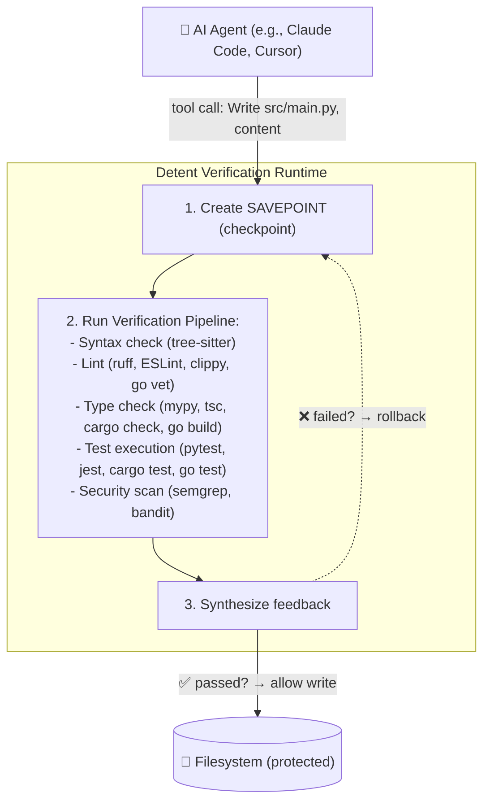

# Detent — Verification Runtime for AI Agents

> **Intercept. Verify. Rollback.** A verification runtime that sits between AI coding agents and the filesystem, running every proposed file write through a configurable verification pipeline and atomically rolling back on failure.

## The Problem

AI coding agents (Claude Code, Cursor, Codex) are powerful but unpredictable. They can write broken code, introduce security issues, or corrupt your codebase—all silently, before you notice.

Existing solutions are slow:

- **Code review tools** require human review (defeats the purpose of agents)
- **CI/CD** runs tests _after_ code hits the repo (too late to prevent damage)
- **Linters in editors** are superficial (don't catch logic errors or test failures)

You need a **protocol-level verification layer** that intercepts tool calls in real time, before they hit the filesystem.

## What Detent Does



## Key Features

✅ **Real-time interception** — Catches bad code before it hits your repo
✅ **Composable verification** — Chain stages: syntax → lint → typecheck → tests
✅ **Atomic rollback** — SAVEPOINT semantics for file operations
✅ **LLM-optimized feedback** — Structured JSON that helps agents self-repair
✅ **CLI + Python SDK** — Use standalone or integrate with agents
✅ **Seven agent adapters** — Claude Code, LangGraph, Cursor, Codex (http/); Gemini, LiteLLM, OpenAPI (hook/)

## How It Differs

| Feature                | Detent | Code Review | CI/CD | Linters          |
| ---------------------- | ------ | ----------- | ----- | ---------------- |
| Real-time interception | ✅     | ❌          | ❌    | ✅ (editor only) |
| Prevents bad code      | ✅     | ❌          | ❌    | ✅ (superficial) |
| Atomic rollback        | ✅     | ❌          | ❌    | ❌               |
| Runs tests             | ✅     | ✅          | ✅    | ❌               |
| Agent-aware feedback   | ✅     | ❌          | ❌    | ❌               |

## Quick Start

### Install

```bash
pip install detent
```

### Initialize in your project

```bash
cd my-project
detent init
```

Interactive setup wizard will ask:

- Which agent you're using (auto-detected or manual)
- Policy strictness (strict/standard/permissive)

### Verify a file

```bash
detent run src/main.py
```

Output:

```
✅ Syntax: PASS
✅ Lint (ruff): PASS
✅ Type check (mypy): PASS
✅ Tests (pytest): PASS

Verification passed! File is safe to write.
Checkpoint: chk_before_write_001
```

If verification fails:

```
❌ Lint (ruff): FAIL
  src/main.py:5:1 - E501: Line too long

Fix suggested:
  Break line at column 100

Rolling back to checkpoint: chk_before_write_001
```

### Check session state

```bash
detent status
```

### Rollback if needed

```bash
detent rollback chk_before_write_001
```

## Architecture

### Two-Point Interception

**Point 1: Conversation Layer** — HTTP reverse proxy intercepts LLM API traffic

- Detects what the agent _plans_ to do
- Extracts tool calls from LLM responses

**Point 2: Tool Execution Layer** — Agent adapters intercept tool calls

- Enforces what the agent is _allowed_ to do
- Creates checkpoint, runs verification, controls execution

### Components

- **Checkpoint Engine** — SAVEPOINT + rollback (in-memory + shadow git)
- **Verification Pipeline** — Composable stages (syntax, lint, typecheck, tests)
- **Feedback Synthesis** — LLM-optimized structured feedback
- **Agent Adapters** — Claude Code, LangGraph, Cursor, Codex (http/); Gemini, LiteLLM, OpenAPI (hook/)
- **CLI** — `detent init`, `detent run`, `detent status`, `detent rollback`
- **Python SDK** — 27 public APIs for programmatic use

## Use Cases

**Solo Developers**

- Verify code before committing to main
- Catch mistakes in real time
- Confidence in agent-generated code

**Teams**

- Prevent broken PRs from blocking CI
- Faster code review (bad code never lands)
- Enforce quality gates automatically

**Research**

- Study agent error patterns
- Benchmark verification techniques
- Feedback synthesis for agent improvement

## Status

✅ **v0.1** (Proof of Concept) — Complete

- Full interception layer
- Verification pipeline with 4 stages
- Feedback synthesis
- 2 agent adapters
- 211+ tests

✅ **v1.0** (Production Ready) — Complete (2026-03-16)

- Python, JavaScript/TypeScript, Go, and Rust verification stages
- All 7 agent adapters (Claude Code, LangGraph, Cursor, Codex, Gemini, LiteLLM, OpenAPI)
- Security scanning (Semgrep, Bandit)
- OpenTelemetry tracing and metrics, circuit breakers
- GitHub Actions CI/CD workflows
- 324+ tests

⏳ **v2.0** (Enterprise) — Q1 2027

- Detent Cloud (SaaS)
- Multi-agent orchestration
- VS Code extension

## Documentation

- [**INSTALLATION.md**](./INSTALLATION.md) — Setup instructions
- [**DEVELOPMENT.md**](./DEVELOPMENT.md) — Developer guide
- [**AGENTS.md**](./AGENTS.md) — Architecture & verification stages
- [**CONTRIBUTING.md**](./CONTRIBUTING.md) — How to contribute
- [**SUPPORT.md**](./SUPPORT.md) — FAQ & troubleshooting

## License

Apache License 2.0 — See [LICENSE](./LICENSE) for details.

## Community

- **GitHub Discussions** — Questions, ideas, show & tell
- **GitHub Issues** — Bugs, feature requests
- **Security** — Vulnerability reports via [GitHub Security Advisories](https://github.com/ofircohen205/detent/security/advisories/new)

---

**Made with ❤️ for AI-assisted development**
