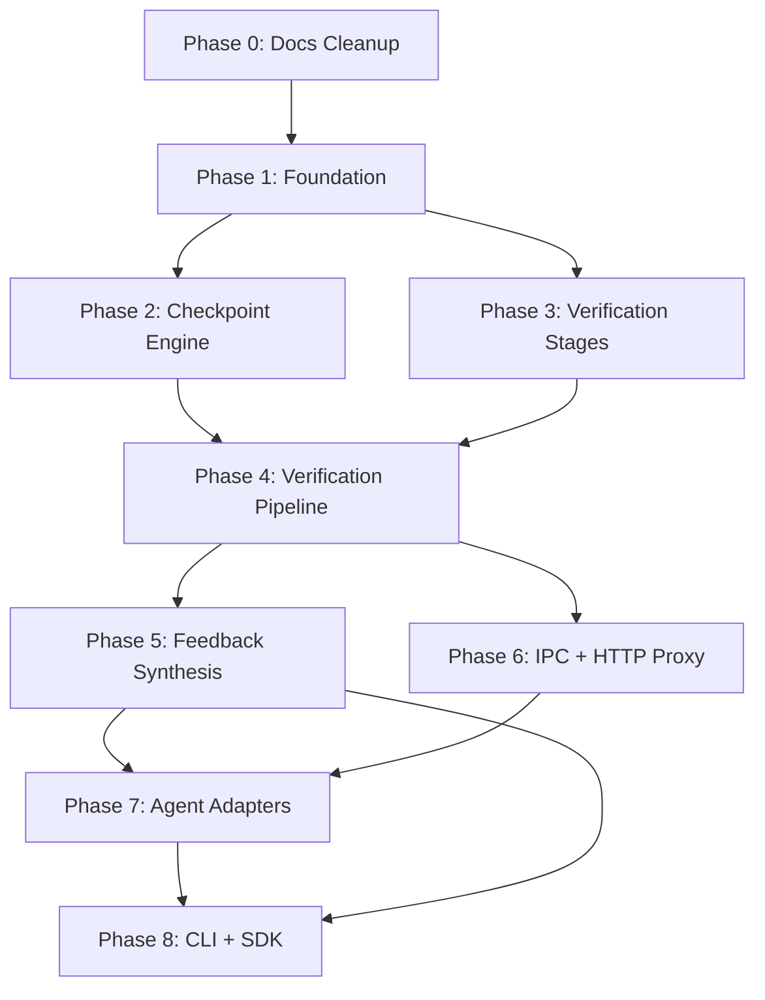

# Detent v0.1 — Implementation Plan

> **Goal:** Build the Detent v0.1 Proof of Concept — a verification runtime that intercepts AI coding agent file writes, runs them through a configurable verification pipeline, and rolls back atomically on failure. Targets Claude Code + LangGraph as the two supported agents.

## Phases

| Phase                                   | Name                  | Status  | Description                              |
| --------------------------------------- | --------------------- | ------- | ---------------------------------------- |
| [0](./phase-0-docs-cleanup.md)          | Documentation Cleanup | ✅ Done | Clean GEMINI.md, CLAUDE.md, AGENTS.md    |
| [1](./phase-1-foundation.md)            | Foundation            | ✅ Done | Schema, config, project setup            |
| [2](./phase-2-checkpoint-engine.md)     | Checkpoint Engine     | ✅ Done | In-memory SAVEPOINTs + shadow git        |
| [3](./phase-3-verification-stages.md)   | Verification Stages   | ⏳      | syntax, lint, typecheck, tests           |
| [4](./phase-4-verification-pipeline.md) | Verification Pipeline | ⏳      | Stage orchestration + result aggregation |
| [5](./phase-5-feedback-synthesis.md)    | Feedback Synthesis    | ⏳      | LLM-optimized structured feedback        |
| [6](./phase-6-ipc-http-proxy.md)        | IPC + HTTP Proxy      | ⏳      | Unix socket IPC + aiohttp reverse proxy  |
| [7](./phase-7-agent-adapters.md)        | Agent Adapters        | ⏳      | Claude Code + LangGraph adapters         |
| [8](./phase-8-cli-sdk.md)               | CLI + SDK             | ⏳      | CLI commands + public Python SDK         |

## Phase Dependencies



> Phases 2 and 3 can be developed in parallel since they share only the schema from Phase 1. Phases 4, 5, and 6 form the middle layer. Phase 7 and 8 integrate everything.

## Full File Manifest

```
detent/
├── __init__.py               (SDK exports)
├── schema.py                 (AgentAction, enums)
├── config.py                 (DetentConfig, YAML loader)
├── cli.py                    (CLI: init, run, status, rollback)
├── proxy/
│   ├── __init__.py
│   └── http_proxy.py         (aiohttp reverse proxy)
├── adapters/
│   ├── __init__.py            (ADAPTERS registry)
│   ├── base.py                (AgentAdapter ABC)
│   ├── claude_code.py         (PreToolUse hooks)
│   └── langgraph.py           (VerificationNode)
├── checkpoint/
│   ├── __init__.py
│   ├── engine.py              (CheckpointEngine)
│   └── savepoint.py           (FileSnapshot, ShadowGit)
├── pipeline/
│   ├── __init__.py
│   ├── pipeline.py            (VerificationPipeline)
│   └── result.py              (VerificationResult, Finding)
├── stages/
│   ├── __init__.py
│   ├── base.py                (VerificationStage ABC)
│   ├── syntax.py              (tree-sitter)
│   ├── lint.py                (Ruff)
│   ├── typecheck.py           (mypy)
│   └── tests.py               (pytest)
├── feedback/
│   ├── __init__.py
│   └── synthesizer.py         (FeedbackSynthesizer)
└── ipc/
    ├── __init__.py
    └── channel.py             (Unix domain socket IPC)

tests/
├── conftest.py                (shared fixtures)
├── unit/                      (fast, no external deps)
└── integration/               (full pipeline tests)
```

## Verification Plan

```bash
# Unit tests (at each phase boundary)
uv run pytest tests/unit/ -v

# Coverage (target: >80%)
uv run pytest tests/unit/ --cov=detent --cov-report=term-missing

# Static checks
make check   # ruff lint + format check + mypy
```

## Source Documents

- [PRD](../../PRD.docx) — Product Requirements Document
- [SRS](../../SRS.docx) — Software Requirements Specification
- [ADD](../../ADD.docx) — Architecture & Design Document
